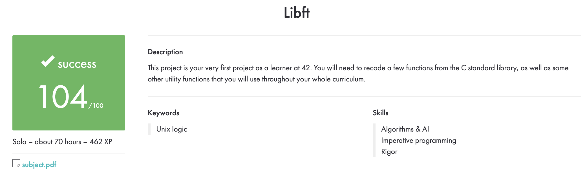

# 📚 libft

> **A custom C library built as part of the 42 School curriculum.**
>
> Libft reimplements a selection of standard C library functions and adds utility functions that can be reused in future C projects.

## 🎯 About the project

The goal of **libft** is to understand how common C utilities work by implementing them from scratch. The library covers character checks, string and memory operations, numeric conversion, file descriptor output, and singly linked lists.

The project produces a static library named `libft.a`, which can be linked into other C programs.

## ✨ What’s included

- 🔤 **Character utilities** — alphabetic, numeric, alphanumeric, ASCII, and printable-character checks, plus case conversion
- 🧵 **String utilities** — length, copying, concatenation, searching, comparison, and duplication
- 🧠 **Memory utilities** — setting, clearing, copying, moving, searching, and comparing memory
- 🔢 **Conversion and allocation** — `ft_atoi`, `ft_calloc`, and `ft_strdup`
- 🔗 **Linked lists** — create, add, iterate, map, and free singly linked list nodes
- 🖨️ **File descriptor output** — write characters, strings, lines, and integers to a selected file descriptor
- 📦 **Static library** — build reusable functions into `libft.a` with the provided Makefile

## 🛠️ Requirements

- A C compiler such as `cc` or `gcc`
- `make`

## 🚀 Build

Clone the repository and enter the project directory:

```bash
git clone <repository-url>
cd libft
```

Build the mandatory library:

```bash
make
```

To include the linked-list bonus functions:

```bash
make bonus
```

The build creates `libft.a` in the project directory.

## 💡 Example

```c
#include "libft.h"

int main(void)
{
    ft_putendl_fd("Hello from libft!", 1);
    return (0);
}
```

Compile your program with the library:

```bash
cc -Wall -Wextra -Werror -I/path/to/libft \
  main.c /path/to/libft/libft.a -o app
```

Replace `/path/to/libft` with the directory containing `libft.h` and `libft.a`.

## 🧹 Makefile commands

| Command | Description |
|---|---|
| `make` | Build the mandatory library |
| `make bonus` | Add the linked-list functions to the library |
| `make clean` | Remove object files |
| `make fclean` | Remove object files and `libft.a` |
| `make re` | Clean and rebuild the mandatory library |

## 🏅 42 evaluation

The project received a **successful score of 104/100**. The evaluation summary is included below as a visual record.



## 🧠 Skills practiced

- C programming and standard-library behavior
- Pointers, dynamic memory, and buffer handling
- Linked-list data structures
- Modular code organization and static libraries
- Building projects with Make

## 👩‍💻 Author

**Sedef Akkaya**  
[GitHub](https://github.com/sakkayaa) · [LinkedIn](https://www.linkedin.com/in/sedef-akkaya-0a5580228/)

---

✨ *Small functions, solid foundations.*
